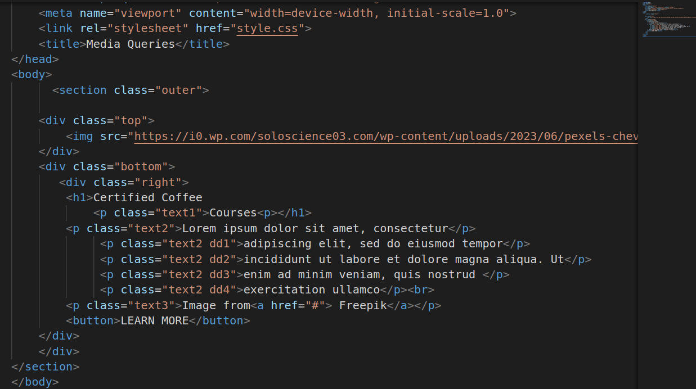
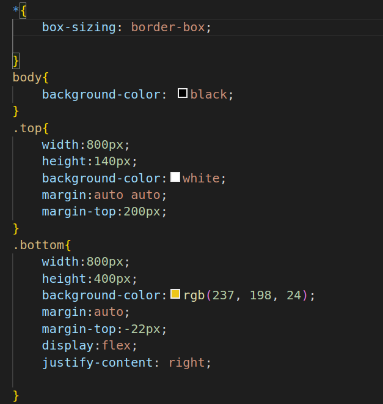
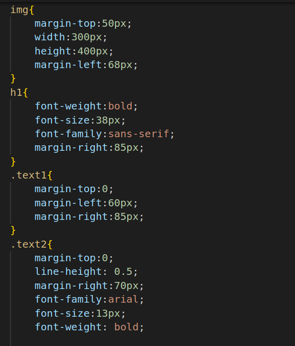
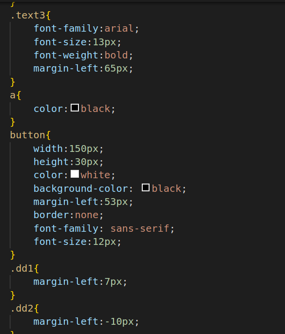
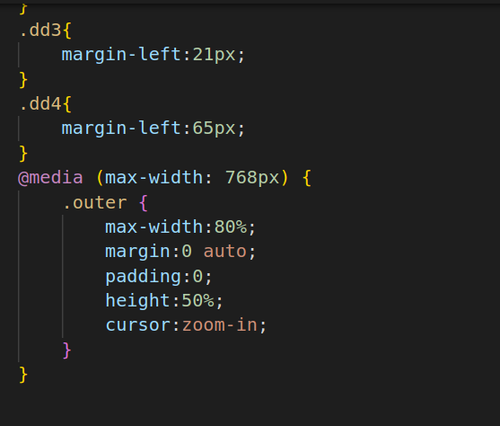

# Media Queries

1.
 
* link rel="stylesheet" href="style.css": This is a link tag used to link an external CSS (Cascading Style Sheets) file to the HTML document. In this case, it's linking to a file called "style.css" to apply styles to the HTML content.
* title Media Queries: The title element is used to specify the title of the HTML document, which typically appears in the browser's title bar or tab. It helps identify the webpage when multiple tabs are open and is also used by search engines for indexing.
* body : The body element represents the main content of the HTML document. All visible content, such as text, images, and other elements, is placed within the body tags.
* section class="outer": The section element is a structural HTML5 element used to define sections or blocks of content within a web page. In this case, it has a class attribute "outer," which can be used to apply specific styles or JavaScript interactions to this section.
* div class="top": This is a division (div) element with a class attribute "top." Divs are generic container elements used to group and style content. In this case, it's likely used for structuring and styling the content at the top of the section.
* img : This is an image element that displays an image. The "src" attribute specifies the image file's URL. It's used to display an image within the "top" div.
* div class="bottom": Similar to the "top" div, this is another division element with a class attribute "bottom." It's used to structure and style the content at the bottom of the section.
* div class="right": This is yet another division element with a class attribute "right." It's used to structure and style the content on the right side of the "bottom" div.
* h1Certified Coffee: This is a heading element (h1) used to represent the main title of the section. Inside the heading, there's a paragraph element (p) with a class attribute "text1" used for styling purposes. It appears to be a part of the main heading.
* p class="text2"Lorem ipsum dolor sit amet, consectetur: This is a paragraph element with a class attribute "text2." It contains some text content and is used for displaying additional information.
* p : These are additional paragraph elements with class attributes "text2 dd1" through "text2 dd4." Each of these paragraphs likely contains different sections of text, possibly related to the main content.
* p: This is another paragraph element with a class attribute "text3." It contains text that seems to credit the image source, with a link (anchor element) to Freepik.
* button: This is a button element used to create an interactive button on the web page. It likely triggers some action when clicked by the user.

2.

3.

* *is a universal selector, targeting all HTML elements.
* box-sizing: border-box; is a CSS property used to include an element's border and padding within its defined width and height, rather than adding them to the width and height. This ensures that elements fit within their designated dimensions.
* body selects the entire body of the HTML document.
* background-color: black; sets the background color of the entire webpage to black.
* top selects an element with the class "top."
* width: 800px; sets the width of the element to 800 pixels.
* height: 140px; sets the height of the element to 140 pixels.
* background-color: white; sets the background color of the element to white.
* margin: auto auto; centers the element horizontally using auto margins.
margin-top: 200px; adds a top margin of 200 pixels.
* bottom selects an element with the class "bottom."
* width: 800px; sets the width of the element to 800 pixels.
* height: 400px; sets the height of the element to 400 pixels.
* background-color: rgb(237, 198, 24); sets the background color to a shade of yellow.
* margin: auto; centers the element horizontally using auto margins.
* margin-top: -22px; moves the element 22 pixels above its default position.
display: flex; makes the element a flex container.
* justify-content: right; aligns flex items to the right within the container.
* img selects all img elements.
* margin-top: 50px; adds a top margin of 50 pixels to the images.
* width: 300px; sets the width of the images to 300 pixels.
* height: 400px; sets the height of the images to 400 pixels.
* margin-left: 68px; adds a left margin of 68 pixels to the images.
* h1 selects all h1 elements.
* font-weight: bold; makes the text within h1 elements bold.
* font-size: 38px; sets the font size of h1 elements to 38 pixels.
* font-family: sans-serif; specifies the font family to be a sans-serif type.
* margin-right: 85px; adds a right margin of 85 pixels to h1 elements.
* .text1 selects elements with the class "text1."
* margin-top: 0; removes any top margin.
margin-left: 60px; adds a left margin of 60 pixels.
* margin-right: 85px; adds a right margin of 85 pixels.
* text2 selects elements with the class "text2."
* margin-top: 0; removes any top margin.
* line-height: 0.5; sets the line height to 0.5 times the font size.
* margin-right: 70px; adds a right margin of 70 pixels.
* font-family: arial; specifies the font family to be Arial.
* font-size: 13px; sets the font size to 13 pixels.
* font-weight: bold; makes the text within these elements bold.

4.

5.

* text3 selects elements with the class "text3."
* font-family: arial; specifies the font family to be Arial.
* font-size: 13px; sets the font size to 13 pixels.
* font-weight: bold; makes the text within these elements bold.
* margin-left: 65px; adds a left margin of 65 pixels.
* a selects all anchor a elements.
* color: black; sets the text color of anchor elements to black.
* button selects all button elements.
width: 150px; sets the width of buttons to 150 pixels.
* height: 30px; sets the height of buttons to 30 pixels.
* color: white; sets the text color of buttons to white.
* background-color: black; sets the background color of buttons to black.
* margin-left: 53px; adds a left margin of 53 pixels to buttons.
* border: none; removes the border around buttons.
* font-family: sans-serif; specifies the font family to be a sans-serif type.
* font-size: 12px; sets the font size of buttons to 12 pixels.
* These are class selectors targeting specific paragraphs (.dd1 through .dd4) and adding left margins to them. Each class selector appears to be used for styling and positioning specific paragraphs within the content.
* @media (max-width: 768px) is a media query that applies the contained styles when the viewport width is at most 768 pixels.
* outer selects an element with the class "outer."
* max-width: 80%; sets the maximum width of the element to 80% of its container.
* margin: 0 auto; centers the element horizontally within its container.
* padding: 0; removes any padding from the element.
* height: 50%; sets the height of the element to 50% of its container.
* cursor: zoom-in; changes the cursor to a zoom-in icon when hovering over the element.

   #Hosted Link
  https://nikhitha5511.github.io/MediaQuery/
